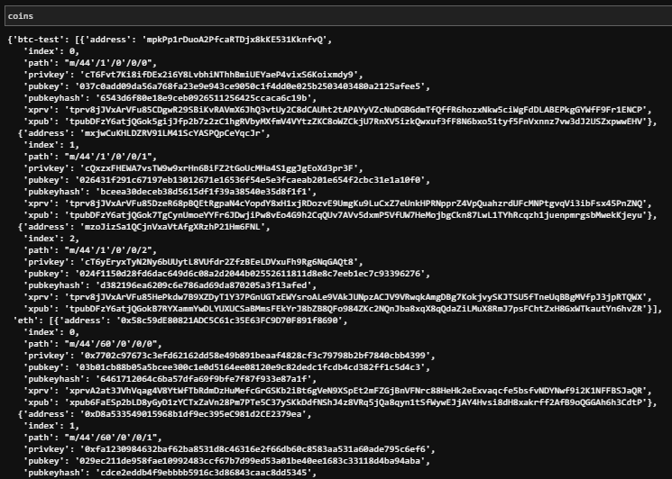
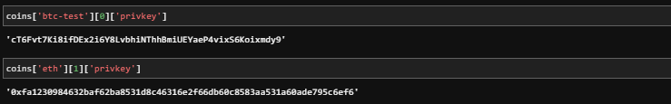
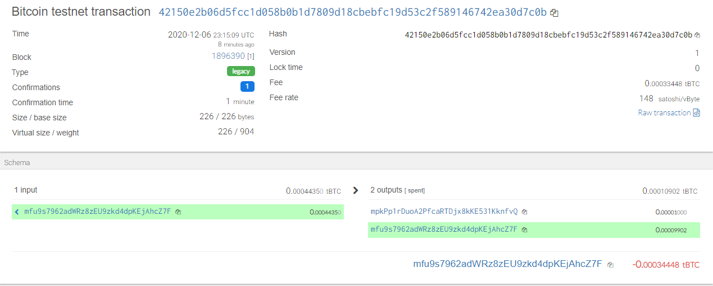

# Multi-Blockchain Wallet in Python


## Universal Blockchain Wallet

Acording to investopedia, A blockchain wallet is a digital wallet that allows users to store and manage their bitcoin and ether. Blockchain Wallet is provided by Blockchain, a software company founded by Peter Smith and Nicolas Cary. A blockchain wallet allows transfers in cryptocurrencies and the ability to convert them back into a user's local currency.

 Main focus of a newly founded company is to build a portfolio management system (PMS) that supports both, traditional assets
(like gold, silver, stocks, etc) and currently very hot topic - crypto-assets!!! But, as there are so many coins out there, our task to understand how HD wallets work, and to build out a system that can create them.

Unfortunately, there aren't as many tools available in Python for this sort of thing, yet.

Thankfully, there is a command line tool, `hd-wallet-derive` that supports not only BIP32, BIP39, and BIP44, but
also supports non-standard derivation paths for the most popular wallets out there today! 

In this project, using hd-wallet-derive tool, i created wallet to get 2 coins working: Ethereum and Bitcoin Testnet.
Since Ethereum keys are the same format on any network, I used the same Ethereum keys from my custom networks that was developed using PoA consensus algorithm. ['PoA BlockChain'](https://github.com/shaifepami/POA_BLOCKCHAIN.git). 
This will demonstrate our wallets ability to not only intereact with publicly available testnet blockchains but be able to interact and make transactions within our local blockchain network using the same wallet. 


## Pre Requisites and Installations

The environment setup and pre requisite installation instructions Please refer to ['Requirements'](/Requirements.md) 

## Creating a Wallet

<details><summary> <b> Setup constants </b> </summary>


- A python file called constants.py` is created to set preset our wallet with predetermined coin types configue the crypto currencies we want to manage using our wallet. This file will be imported into our wallet.py to make the configured token/coin types accessible via our wallet program via referencing these strings, both in function calls, and in setting object keys.

  - `BTC = 'btc'`
  - `ETH = 'eth'`
  - `BTCTEST = 'btc-test'`

</details>

<details><summary> <b>Generating a Mnemonic </b> </summary>

- I Generated a new 12 or 15 word mnemonic using `hd-wallet-derive` or by using [this tool](https://iancoleman.io/bip39/).

- I Set this mnemonic as an environment variable, and save it in .ENV file which can be called via the wallet everytime you want to access the wallet keys: `mnemonic = os.getenv('MNEMONIC', 'insert mnemonic here')`

</details>

<details><summary> <b>Deriving the wallet keys </b> </summary>

- I made use of the `subprocess` library to call the `./derive` script from Python. 

- The following flags are configured/passed into the shell command as variables:
  - Mnemonic (`--mnemonic`) must be set from an environment variable, or default to a test mnemonic
  - Coin (`--coin`)   - reads from the constants.py program we imported. 
  - Numderive (`--numderive`) to set number of child keys generated
  - cols - columns headers from the bip44 output
  - the ./derive script command will look like 

```shell
  'php derive -g --mnemonic= Mnemonic  --coin= Coin --numderive=Numderive  --cols= columns  --format=json'

  ```

- With the `--format=json` flag, I parse the output into a JSON object using `json.loads(output)` and return the dictionary object of keys & addresses for each of the crypto currencies. The object is assigned to a dictionary variable called coins, when called will show the output as below.



I selected child accounts (and thus, private keys) by calling `coins[COINTYPE][INDEX]['privkey']` where the token is either BTCTEST or ETH, index is the index # of the key for each token and the 'privkey' as the reference to the dictionary item. 



- All  the above is wrapped into one function, called `derive_wallets` which uses the parameters/flags configured above and fetches the keys from 
[this tool](https://iancoleman.io/bip39/) using your Mnemonic phrase. 


</details>

<details><summary> <b>Linking the transaction signing libraries</b> </summary>

Using `bit` and `web3.py` to leverage the keys I got in the `coins` object using three core functions:

- Function `priv_key_to_account` -- this will convert the `privkey` string in a child key to an account object that `bit` or `web3.py` can use to transact. This function accepts the following parameters: 

  - `coin` -- the coin type (defined in `constants.py`).
  - `priv_key` -- the `privkey` string will be passed through here.

  Depending on the coin/token we seleccted, this function returns one of the following based on the library:

  - For `ETH`, returns `Account.privateKeyToAccount(priv_key)`
      - Account.privateKeyToAccount function is part of web3 librarary which returns an account object from the private key string. 	(https://web3js.readthedocs.io/en/v1.2.0/web3-eth-accounts.html#privatekeytoaccount).
  - For `BTCTEST`, return `PrivateKeyTestnet(priv_key)`
      - PrivateKeyTestnet is part of bit.py libarary that converts the private key string into a WIF (Wallet Import Format) object. WIF is a special 	format bitcoin uses to designate the types of keys it generates. [here](https://ofek.dev/bit/dev/api.html).

- Function `create_tx` -- this function will create the raw, unsigned transaction that contains all metadata needed to transact. The following parameters are to be passed to this function 
  - `coin` -- the coin type (defined in `constants.py`).
  - `account` -- the account object from `priv_key_to_account`.
  - `to` -- the recipient address.
  - `amount` -- the amount of the coin to send.

  Depending on the type of coin selected, this function returns one of the following functions based on the library:

  - For `ETH`, return an object containing `to`, `from`, `value`, `gas`, `gasPrice`, `nonce`, and `chainID`.
  - For `BTCTEST`, return `PrivateKeyTestnet.prepare_transaction(account.address, [(to, amount, BTC)])`

- Function `send_tx` -- this call `create_tx`, sign the transaction, then send it to the designated network. This function accepts the following parameters:

  - `coin` -- the coin type (defined in `constants.py`).
  - `account` -- the account object from `priv_key_to_account`.
  - `to` -- the recipient address.
  - `amount` -- the amount of the coin to send.

  Depending on the type of coin selected, the function creates a `raw_tx` object by calling `create_tx` and then signs the raw transaction using 
  using `bit` or `web3.py' and broadcasts to the respective blockchain networks.

  - For `ETH`, return `w3.eth.sendRawTransaction(signed.rawTransaction)`
  - For `BTCTEST`, return `NetworkAPI.broadcast_tx_testnet(signed)`

Now, we should be able to fund these wallets using testnet faucets. 

</details>

<details><summary> <b>Bitcoin Testnet transaction </b> </summary>

- Fund a `BTCTEST` address using [this testnet faucet](https://testnet-faucet.mempool.co/).

- Use a [block explorer](https://tbtc.bitaps.com/) to watch transactions on the address.

- Send a transaction to another testnet address (either one of your own, or return back a part of the fund recieved to the sender).

- Below is the Screenshot of transaction confirmation:



</details>

<details><summary> <b> 
Local PoA Ethereum transaction using </b> </summary>

- Please refer to the POA blockchain development [POA Testnet](https://github.com/shaifepami/POA_BLOCKCHAIN) 
- Add one of the `ETH` addresses to the pre-allocated accounts in your `samchain.json`.

- Initialize using `geth --datadir nodeX init samchain.json`. This will run our preconfigured local blockchain, and will pre-fund the new account.

- open myCrypto tool and connect to your local testnet node. If the local blockchain network is not running the transaction will fail. 

- Send a transaction from the pre-funded address within the wallet to another, then copy the `txid` into
  MyCrypto's TX Status. Below is the screenshot of successful transaction :

  

</details>


## Accessing the wallet functions using Jupyter Notebook

if you would like to play around with the functions or would like to add more, please use the [Notebook](/wallet.ipynb)
